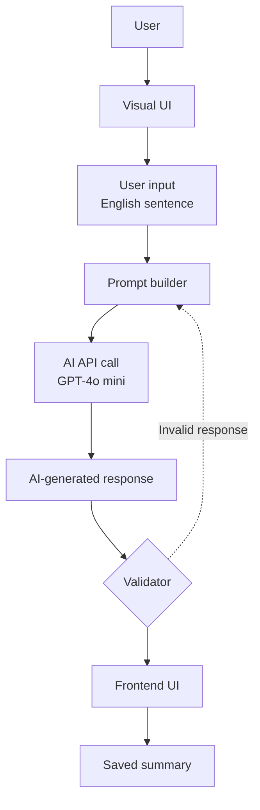

# High-Level Architecture

## Flow

1. The user enters an English sentence in the visual interface.
2. The prompt builder prepares it for the AI model.
3. The application sends the prompt to GPT-4o mini and receives a response.
4. A validator checks the response. Invalid responses return to the prompt-building step.
5. Valid responses are shown in the frontend and saved in the summary.
